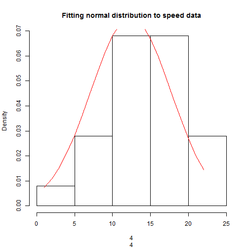

## This presentation covers the following topic

1. Why I decided to do this app
2. What is the app actually doing
3. Some calculation that are performed insidy my app

--- .class #id 

## Why I decided to do this app

I recently got into fitting distributions to data, and I find it usefull.

Usually the simple distribution fitting process involves changing parameters and checking some plots.
This is exactly what I decided to do.

--- .class #id 

## What is the app actually doing

The App is not doing any magic.

It simply takes some data and creates a histogram and cumulative distribution function and then adds a Normal Distribution curves to the graph to show you the fit.

The initial fit uses Mean and SD of the data, but then the user is allowed to tweek these values, to achieve a better fit.

--- .class #id 

## Some calculation that are performed insidy my app


```r
data<-cars$speed
hist(data, prob=TRUE, main='Fitting normal distribution to speed data', xlab=data)
lines(dnorm(seq(min(data),max(data),1),mean=mean(data),sd=sd(data)),col="red")
```

 

--- .class #id 

